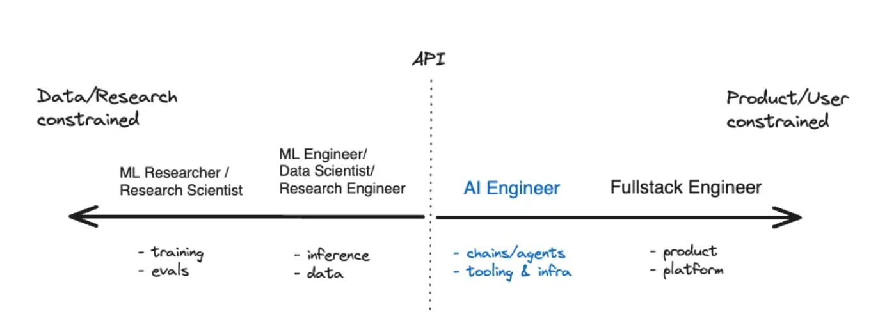

# The AI Engineer Bootcamp

  
   

## Motivation

> Learn how to become an AI Engineer.
>
> Prep for the AI Engineer interview.

### Why become an AI Engineer?

AI Engineering is set to become the profession of the next decade, unlocking numerous possibilities develop with AI at unprecedented speed. 

AI Engineering is a broad topic.  There is a **vast amount of resources scattered throughout the web** on AI Engineering.

This repo is an **organized collection** of resources to help you learn how to build with AI. 

### Learn from the open source community

This is a continually updated, open source project.

[Contributions](#contributing) are welcome!

Review the [Contributing Guidelines](CONTRIBUTING.md).

## Index of system design topics

> Summaries of various AI Engineering topics, including pros and cons.  **Everything is a trade-off**.
>
> Each section contains links to more in-depth resources.

* [AI Engineering Intro: start here](#ai-engineer-intro-start-here)
    * [Step 1: What is AI Engineering](#step-1-what-is-ai-engineering)
    * [Step 2: What is LLMS](#step-2-what-is-llms)

## AI Engineering Intro: start here

New to AI Engineering?

First, you'll need a basic understanding of common principles, learning about what they are, how they are used, and their pros and cons.

### Step 1: What is AI Engineering

[AI Engineer articly by swyx](https://www.latent.space/p/ai-engineer)

### Step 2: What is LLMS

[Overview and Application of LLMs](https://leighmariebraswell.substack.com/p/overview-and-applications-of-large)

## Contact info

Feel free to contact me to discuss any issues, questions, or comments.

My contact info can be found on my [GitHub page](https://github.com/diyrl).

## License

*I am providing code and resources in this repository to you under an open source license.  Because this is my personal repository, the license you receive to my code and resources is from me and not my employer.*

    Copyright 2023 diyrl

    Creative Commons Attribution 4.0 International License (CC BY 4.0)

    http://creativecommons.org/licenses/by/4.0/
